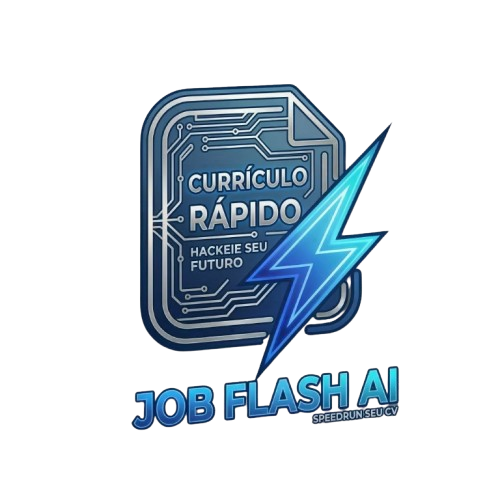

<div align="center"> 
   <br /> 
        
   
   <br /> 
 
   <div> 
      
      
      
      
      
      
   </div> 
 
   <h3 align="center">JobFlashAI - Gerador de Currículos com IA</h3> 
 
 </div> 
 
## <a name="introduction">🤖 Introdução</a> 
Desenvolvido com as mais recentes tecnologias Next.js e TypeScript, o JobFlashAI é uma ferramenta avançada de criação de currículos com inteligência artificial. Ele permite que os usuários criem currículos profissionais de forma rápida e fácil, com recursos de geração automática de conteúdo usando a API Gemini da Google. Este projeto é perfeito para quem busca destacar-se no mercado de trabalho com um currículo bem estruturado e profissional.
 
## <a name="tech-stack">⚙️ Tech Stack</a> 
 
- Next.js 15 (App Router) 
- TypeScript 
- Tailwind CSS 
- Gemini API (Google AI) 
- Prisma (ORM) 
- React Hook Form 
- Zod (Validação) 
- Clerk (Autenticação) 
- Zustand (Gerenciamento de Estado) 
- ShadCN/UI (Componentes) 
 
## <a name="features">🔋 Funcionalidades</a> 
 
👉 **Editor de Currículos Intuitivo:** Interface amigável para criar e editar currículos passo a passo. 
 
👉 **Geração de Resumo Profissional:** Cria automaticamente um resumo profissional impactante com base nas informações fornecidas, utilizando IA. 
 
👉 **Melhoria de Experiências Profissionais:** Aprimora as descrições de experiências de trabalho para destacar realizações e responsabilidades. 
 
👉 **Sugestão de Habilidades:** Sugere habilidades relevantes com base no cargo desejado e na indústria. 
 
👉 **Personalização Visual:** Permite personalizar cores, bordas e estilos do currículo. 
 
👉 **Salvamento Automático:** Salva automaticamente as alterações para evitar perda de dados. 
 
👉 **Visualização em Tempo Real:** Mostra uma prévia do currículo enquanto você o edita. 
 
👉 **Impressão e Exportação:** Permite imprimir ou salvar o currículo em formato adequado para compartilhamento. 
 
👉 **Gerenciamento de Múltiplos Currículos:** Crie e gerencie vários currículos para diferentes oportunidades. 
 
👉 **Design Responsivo:** Garante uma experiência perfeita em diferentes dispositivos. 
 
## <a name="installation">🛠️ Instalação e Configuração</a> 
 
### **Clonando o Repositório** 
 
```bash 
git clone https://github.com/seu-usuario/jobflashai.git 
cd jobflashai 
``` 
 
### **Instalação** 
 
Instale as dependências do projeto usando npm, yarn ou pnpm: 
 
```bash 
npm install 
# ou 
yarn install 
# ou 
pnpm install 
``` 
 
### **Configuração das Variáveis de Ambiente** 
 
Crie um arquivo `.env.local` na raiz do projeto e adicione as seguintes variáveis: 
 
```env 
# Banco de Dados 
DATABASE_URL="sua-url-do-banco-de-dados" 

# Autenticação (Clerk) 
CLERK_SECRET_KEY="sua-chave-secreta-do-clerk" 
NEXT_PUBLIC_CLERK_PUBLISHABLE_KEY="sua-chave-publica-do-clerk" 
CLERK_WEBHOOK_SECRET="seu-segredo-de-webhook-do-clerk" 

# Google Gemini API 
GEMINI_API_KEY="sua-chave-da-api-gemini" 

# Vercel Blob Storage (para armazenamento de imagens) 
BLOB_READ_WRITE_TOKEN="seu-token-do-vercel-blob" 
``` 
 
### **Configuração do Banco de Dados** 
 
Execute as migrações do Prisma para configurar o banco de dados: 
 
```bash 
npx prisma migrate dev 
``` 
 
### **Executando o Projeto** 
 
```bash 
npm run dev 
# ou 
yarn dev 
# ou 
pnpm dev 
``` 
 
Acesse [http://localhost:3000](http://localhost:3000) no seu navegador para visualizar o projeto. 
 
## <a name="usage">📋 Como Usar</a> 
 
1. **Crie uma conta** ou faça login no sistema 
2. Clique em "Começar agora" para criar um novo currículo 
3. Siga o processo passo a passo para preencher as informações: 
   - Informações gerais (nome, cargo desejado) 
   - Informações pessoais (contato, localização) 
   - Experiências profissionais (com opção de geração por IA) 
   - Formação acadêmica 
   - Habilidades (com sugestões por IA) 
   - Resumo profissional (com geração automática) 
4. Personalize o visual do seu currículo com as opções de estilo 
5. Visualize, imprima ou exporte seu currículo finalizado 
 
## <a name="contributing">🤝 Contribuindo</a> 
 
Contribuições são bem-vindas! Para contribuir: 
 
1. Faça um fork do projeto 
2. Crie uma branch para sua feature (`git checkout -b feature/nova-feature`) 
3. Faça commit das suas alterações (`git commit -m 'Adiciona nova feature'`) 
4. Faça push para a branch (`git push origin feature/nova-feature`) 
5. Abra um Pull Request 
 
## <a name="license">📄 Licença</a> 
 
Este projeto está licenciado sob a licença MIT - veja o arquivo LICENSE para mais detalhes. 
 
--- 
 
Desenvolvido com ❤️ usando Next.js, TypeScript e Google Gemini API.