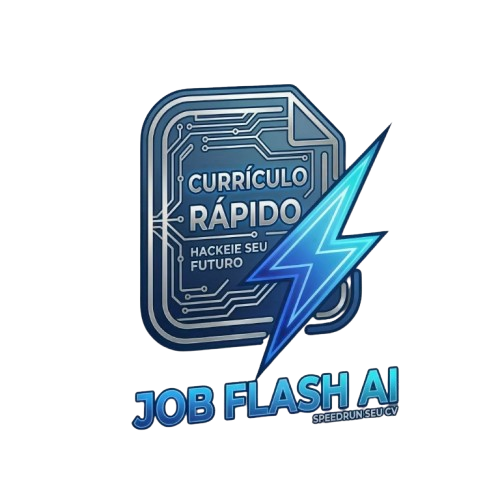

<div align="center"> 
   <br /> 
        
   
   <br /> 
 
   <div> 
      
      
      
      
      
      
   </div> 
 
   <h3 align="center">JobFlashAI - Gerador de Currículos com IA</h3> 
 
 </div> 
 
## <a name="introduction">🤖 Introdução</a> 
Desenvolvido com as mais recentes tecnologias Next.js e TypeScript, o JobFlashAI é uma ferramenta avançada de criação de currículos com inteligência artificial. Ele permite que os usuários criem currículos profissionais de forma rápida e fácil, com recursos de geração automática de conteúdo usando a API Gemini da Google. Este projeto é perfeito para quem busca destacar-se no mercado de trabalho com um currículo bem estruturado e profissional.
 
## <a name="tech-stack">⚙️ Tech Stack</a> 
 
- Next.js 15 (App Router) 
- TypeScript 
- Tailwind CSS 
- Gemini API (Google AI) 
- Prisma (ORM) + PostgreSQL (Vercel Postgres) 
- React Hook Form 
- Zod (Validação) 
- Clerk (Autenticação) 
- Vercel Blob (Armazenamento de fotos) 
- Zustand (Gerenciamento de Estado) 
- ShadCN/UI (Componentes) 
- Cakto (Pagamentos) 
 
## <a name="features">🔋 Funcionalidades</a> 
 
👉 **Editor de Currículos Intuitivo:** Interface amigável para criar e editar currículos passo a passo. 
 
👉 **Geração de Resumo Profissional:** Cria automaticamente um resumo profissional impactante com base nas informações fornecidas, utilizando IA. 
 
👉 **Melhoria de Experiências Profissionais:** Aprimora as descrições de experiências de trabalho para destacar realizações e responsabilidades. 
 
👉 **Sugestão de Habilidades:** Sugere habilidades relevantes com base no cargo desejado e na indústria. 
 
👉 **Personalização Visual:** Permite personalizar cores, bordas e estilos do currículo. 
 
👉 **Múltiplos Templates:** Templates Clássico, Harvard e Modern com sidebar — escolha o estilo ideal. 
 
👉 **Tradução de Currículo:** Traduz o currículo completo para inglês ou português com um clique. 
 
👉 **Salvamento Automático:** Salva automaticamente as alterações para evitar perda de dados. 
 
👉 **Visualização em Tempo Real:** Mostra uma prévia do currículo enquanto você o edita. 
 
👉 **Impressão e Exportação:** Permite imprimir ou salvar o currículo em formato PDF. 
 
👉 **Avaliação ATS:** Analisa o currículo com base em descrições de vagas para maximizar a taxa de aprovação em sistemas ATS. 
 
👉 **Planos de Assinatura:** Plano gratuito e planos pagos via Cakto com controle de funcionalidades por tier. 
 
👉 **Gerenciamento de Múltiplos Currículos:** Crie e gerencie vários currículos para diferentes oportunidades. 
 
## <a name="installation">🛠️ Instalação e Configuração</a> 
 
### **Clonando o Repositório** 
 
```bash 
git clone https://github.com/gildairmoreira/JobFlashAI.git
cd JobFlashAI
``` 
 
### **Instalação** 
 
Instale as dependências do projeto usando npm, yarn ou pnpm: 
 
```bash 
npm install 
# ou 
yarn install 
# ou 
pnpm install 
``` 
 
### **Configuração das Variáveis de Ambiente** 
 
Crie um arquivo `.env.local` na raiz do projeto. As variáveis abaixo são necessárias para o funcionamento completo:

```env
# ============================================================
# BANCO DE DADOS — Vercel Postgres (gerado automaticamente no painel Vercel)
# ============================================================
POSTGRES_URL="postgres://..."
POSTGRES_PRISMA_URL="postgres://...?pgbouncer=true&connect_timeout=15"
POSTGRES_URL_NO_SSL="postgres://..."
POSTGRES_URL_NON_POOLING="postgres://..."
POSTGRES_USER="seu-usuario"
POSTGRES_HOST="seu-host.vercel-storage.com"
POSTGRES_PASSWORD="sua-senha"
POSTGRES_DATABASE="verceldb"

# ============================================================
# AUTENTICAÇÃO — Clerk (https://clerk.com)
# ============================================================
NEXT_PUBLIC_CLERK_PUBLISHABLE_KEY="pk_test_..."
CLERK_SECRET_KEY="sk_test_..."
NEXT_PUBLIC_CLERK_SIGN_IN_URL="/sign-in"
NEXT_PUBLIC_CLERK_SIGN_UP_URL="/sign-up"

# ============================================================
# ARMAZENAMENTO DE FOTOS — Vercel Blob (https://vercel.com/storage/blob)
# ============================================================
BLOB_READ_WRITE_TOKEN="vercel_blob_rw_..."

# ============================================================
# IA — Google Gemini (https://aistudio.google.com/app/apikey)
# ============================================================
GEMINI_API_KEY="AIza..."

# ============================================================
# PAGAMENTOS — Cakto (https://cakto.com.br)
# ============================================================
CAKTO_WEBHOOK_SECRET="seu-webhook-secret-cakto"
CAKTO_CLIENT_ID="seu-client-id-cakto"
CAKTO_CLIENT_SECRET="seu-client-secret-cakto"

# ID dos produtos/ofertas na Cakto
CAKTO_PRO_PRODUCT_ID="id-do-produto-pro"
CAKTO_MONTHLY_PRODUCT_ID="id-do-produto-mensal"

# URLs de checkout geradas na Cakto para cada plano
CAKTO_PRO_CHECKOUT_URL="https://app.cakto.com.br/checkout/..."
CAKTO_MONTHLY_CHECKOUT_URL="https://app.cakto.com.br/checkout/..."

# ============================================================
# URL BASE DA APLICAÇÃO
# ============================================================
NEXT_PUBLIC_BASE_URL="http://localhost:3000"
# Em produção: NEXT_PUBLIC_BASE_URL="https://seu-dominio.com"
```

### **Configuração do Banco de Dados** 
 
Execute as migrações do Prisma para configurar o banco de dados: 
 
```bash 
npx prisma migrate dev 
```

> **Dica:** Se estiver usando Vercel Postgres, as variáveis `POSTGRES_*` são geradas automaticamente ao conectar o banco no painel da Vercel. Basta copiar do painel para o `.env.local`.
 
### **Executando o Projeto** 
 
```bash 
npm run dev 
# ou 
yarn dev 
# ou 
pnpm dev 
``` 
 
Acesse [http://localhost:3000](http://localhost:3000) no seu navegador para visualizar o projeto. 
 
## <a name="usage">📋 Como Usar</a> 
 
1. **Crie uma conta** ou faça login no sistema 
2. Clique em "Começar agora" para criar um novo currículo 
3. Siga o processo passo a passo para preencher as informações: 
   - Informações gerais (nome, cargo desejado) 
   - Informações pessoais (contato, localização) 
   - Experiências profissionais (com opção de geração por IA) 
   - Formação acadêmica 
   - Habilidades (com sugestões por IA) 
   - Resumo profissional (com geração automática) 
   - Seções customizadas (Projetos, Idiomas, etc.) 
4. Escolha o template e personalize o visual do seu currículo 
5. Avalie o currículo com o analisador ATS (plano Pro) 
6. Visualize, imprima ou exporte seu currículo finalizado 
 
## <a name="contributing">🤝 Contribuindo</a> 
 
Contribuições são bem-vindas! Para contribuir: 
 
1. Faça um fork do projeto 
2. Crie uma branch para sua feature (`git checkout -b feature/nova-feature`) 
3. Faça commit das suas alterações (`git commit -m 'feat: Adiciona nova feature'`) 
4. Faça push para a branch (`git push origin feature/nova-feature`) 
5. Abra um Pull Request 
 
## <a name="license">📄 Licença</a> 
 
Este projeto está licenciado sob a licença MIT - veja o arquivo LICENSE para mais detalhes. 
 
--- 
 
Desenvolvido com ❤️ usando Next.js, TypeScript e Google Gemini API.